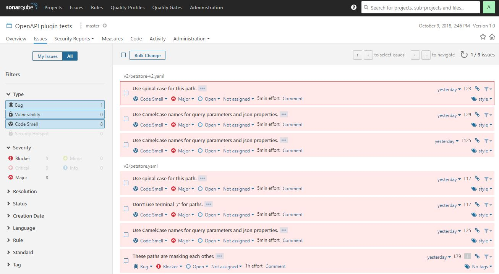

# 🛠️ Sonar OpenApi (plugin)     [](https://www.gnu.org/licenses/lgpl-3.0) 

Sonar OpenApi (plugin) is a code analyzer for OpenAPI specifications,  is the spiritual successor of [SonarOpenApi](https://github.com/societe-generale/sonar-openapi), carrying on from the point where it left off with support of Apiaddicts community.

### This repository is intended for :octocat: **community** use, it can be modified and adapted without commercial use. If you need a version, support or help for your **enterprise** or project, please contact us 📧 devrel@apiaddicts.org
### 💡 If you have an idea for a rule but you are not sure that everyone needs it you can implement a [custom rule](CustomRules.md) available only for you.

[](https://twitter.com/APIAddicts) 
[](https://discord.gg/ZdbGqMBYy8)
[](https://www.linkedin.com/company/apiaddicts/)
[](https://www.facebook.com/apiaddicts)
[](https://www.youtube.com/@APIAddictslmaoo)

# 🙌 Join the **Sonar OpenApi (plugin)** Adopters list 
📢 If Sonar OpenApi is part of your organization's toolkit, we kindly encourage you to include your company's name in our Adopters list. 🙏 This not only significantly boosts the project's visibility and reputation but also represents a small yet impactful way to give back to the project.

| Organization  | Description of Use / Referenc |
|---|---|
|  [CloudAppi](https://cloudappi.net/)  | Apification and generation of microservices |
| [Madrid Digital](https://www.comunidad.madrid/servicios/sede-electronica/madrid-digital/)  | Generation of microservices  |
| [Apiquality](https://apiquality.io/)  | Generation of microservices  |

# 👩🏽‍💻  Contribute to ApiAddicts 

We're an inclusive and open community, welcoming you to join our effort to enhance ApiAddicts, and we're excited to prioritize tasks based on community input, inviting you to review and collaborate through our GitHub issue tracker.

Feel free to drop by and greet us on our GitHub discussion or Discord chat. You can also show your support by giving us some GitHub stars ⭐️, or by following us on Twitter, LinkedIn, and subscribing to our YouTube channel! 🚀

[](https://www.buymeacoffee.com/apiaddicts)


## ⚙️ Features

* Full compatibility with OpenAPI v2.0, v3.0.0, v3.0.1, v3.0.2 and v3.0.3



<a name="install"></a>
## Installing

To install the plugin, you need to compile it, then install it in your SonarQube server.

1. Make sure you have at least JDK1.8 installed, as well as Maven 3.0.5 or later. They must be present in your PATH.
2. In the master directory of the project, type `mvn install`. This will compile the project and generate the artifacts.
3. Copy the file `sonar-openapi-plugin/target/sonar-openapi-plugin-<version>.jar` into directory `extensions/plugins/`of
   your SonarQube installation (you can install a local copy [from here](https://www.sonarqube.org/downloads/) for testing).
4. Restart your SonarQube server.

## Analyzing your projects

To analyze your projects, you must first [install](#install) the plugin.

### Configuring sonar-scanner

Once installed, configure the analysis properties by creating the `sonar-project.properties` at the root of your project.
[Sonar-scanner](https://docs.sonarqube.org/latest/analysis/scan/sonarscanner/) will look for this file when 
launching the analysis. Alternatively, you can define these properties as environment variables or using the Sonar Maven plugin.

An example configuration file is provided below for reference:

```properties
# must be unique in a given SonarQube instance
sonar.projectKey=test:openapi
# this is the name and version displayed in the SonarQube UI. Was mandatory prior to SonarQube 6.1.
sonar.projectName=OpenAPI plugin tests
sonar.projectVersion=1.0
 
# Path is relative to the sonar-project.properties file. Replace "\" by "/" on Windows.
# This property is optional if sonar.modules is set. 
sonar.sources=.
  
# Encoding of the source code. Default is default system encoding
sonar.sourceEncoding=UTF-8
# Select the language to use for analysis 
sonar.language=openapi
```

For details about how to configure SonarQube Scanner to analyze your projects, see [the documentation](https://docs.sonarqube.org/display/SCAN/Analyzing+with+SonarQube+Scanner).

### Configuring the plugin

The plugin automatically scans all `.yaml` and `.json` files that are compatible with the OpenAPI spec.

Is considered to be compatible with OpenAPI v2 spec if the file contains the root key `swagger` and compatible with the v3 if contains `openapi`.

### Running the analysis

* Make sure the SonarQube server is running
* [Generate a token](https://docs.sonarqube.org/latest/user-guide/user-token/) to authenticate to the server, or ask for one to your administrator
* With `sonar-scanner` in you path, just launch the tool from the directory where you have created `sonar-project.properties`.
* Make sure you specify the sonar server and token when launching the analysis

You should obtain an output similar to that:

```text
D:\git\testSonar>sonar-scanner -Dsonar.host.url=<your Sonar server> -Dsonar.login=<authorization token>
INFO: -------------  Scan OpenAPI plugin tests
INFO: Base dir: D:\git\testSonar
INFO: Working dir: d:\git\testSonar\.sonar
INFO: Source paths: .
INFO: Source encoding: UTF-8, default locale: en_US
INFO: Load server rules
INFO: Load server rules (done) | time=229ms
INFO: Index files
INFO: 4 files indexed
INFO: Quality profile for openapi: Sonar way
INFO: Sensor SonarJavaXmlFileSensor [java]
INFO: Sensor SonarJavaXmlFileSensor [java] (done) | time=1ms
INFO: Sensor OpenAPI Scanner Sensor [openapi]
INFO: Sensor OpenAPI Scanner Sensor [openapi] (done) | time=270ms
INFO: Sensor Zero Coverage Sensor
INFO: Sensor Zero Coverage Sensor (done) | time=8ms
INFO: No SCM system was detected. You can use the 'sonar.scm.provider' property to explicitly specify it.
INFO: Calculating CPD for 6 files
INFO: CPD calculation finished
INFO: Analysis report generated in 215ms, dir size=92 KB
INFO: Analysis reports compressed in 37ms, zip size=17 KB
INFO: Analysis report uploaded in 75ms
INFO: ANALYSIS SUCCESSFUL, you can browse <your Sonar server>/dashboard?id=test%3Aopenapi
INFO: Note that you will be able to access the updated dashboard once the server has processed the submitted analysis report
INFO: More about the report processing at <your Sonar server>/api/ce/task?id=AWZZE5MdehEa_CTMQA3m
INFO: Task total time: 3.356 s
INFO: ------------------------------------------------------------------------
INFO: EXECUTION SUCCESS
INFO: ------------------------------------------------------------------------
```

Then, log into your SonarQube server and go to your project to see the found violations (if any).

### Skipping rules

Sometimes, it makes sense to disable a rule altogether. The plugin comes with a way to control which rule is enabled on
a specific file. Use it with caution as it is generally a bad practice to disable a rule from code!

The `x-nosonar` OpenAPI extension completely disables a rule. Add it to the top-level OpenAPI document to disable a rule
or a set of rules:

```yaml
openapi: "3.0.0"
info:
  version: 1.0.0
  title: Swagger Petstore
  license:
    name: MIT
servers:
  - url: http://petstore.swagger.io/v1
x-nosonar: [ RuleId1, RuleId2 ]
```

You can pass either a string or an array of string to the extension.

To disable a rule only in a specific API element, use the `x-sonar-disable` extension. To enable an otherwise globally
disable rule, use the `x-sonar-enable` extension. They are recognized in any API element that supports extensions, except
on the top-level document.

```yaml
openapi: "3.0.0"
info:
  version: 1.0.0
  title: Swagger Petstore
  license:
    name: MIT
servers:
  - url: http://petstore.swagger.io/v1
x-nosonar: [ RuleId1, RuleId2 ]
paths:
  /pets:
    get:
      # This re-enables RuleId1 in this operation only (it is not inherited by child elements like tags or parameters)
      x-sonar-enable: RuleId1
      summary: List all pets
      operationId: listPets
      tags:
        - pets
      parameters:
        - name: filter
          in: query
          description: attribute on which to filter
          required: false
          schema:
            type: string
          # This disables RuleId3 locally in this parameter (it is not inherited by child elements like schema)
          x-sonar-disable: RuleId3
```

As for `x-nosonar`, the `x-sonar-disable` and `x-sonar-enable` extensions accept a single string or an array of strings.

<a name="testing"></a>
## Testing

To run tests locally follow these instructions.

### Build the Project and Run Unit Tests

To build the plugin and run its unit tests, execute this command from the project's root directory:

    mvn clean install

### Integration Tests

Integration tests are provided with the plugin. To include them, use the "its" profile:

    mvn -Pits clean install

If you are running behind an enterprise proxy, specify the java proxy options on the command line:

- http.proxyHost
- http.proxyPort
- http.proxyUser
- http.proxyPassword
- https.proxyHost
- https.proxyPort
- https.proxyUser
- https.proxyPassword

### Performing a new release

Validate that all is correct:

`mvn clean package -Prelease`

Deploy:

`mvn clean deploy -Prelease`

## 💛 Sponsors
<p align="center">
	<a href="https://apiaddicts.org/">
    	
        
        
        
	</a>
</p>